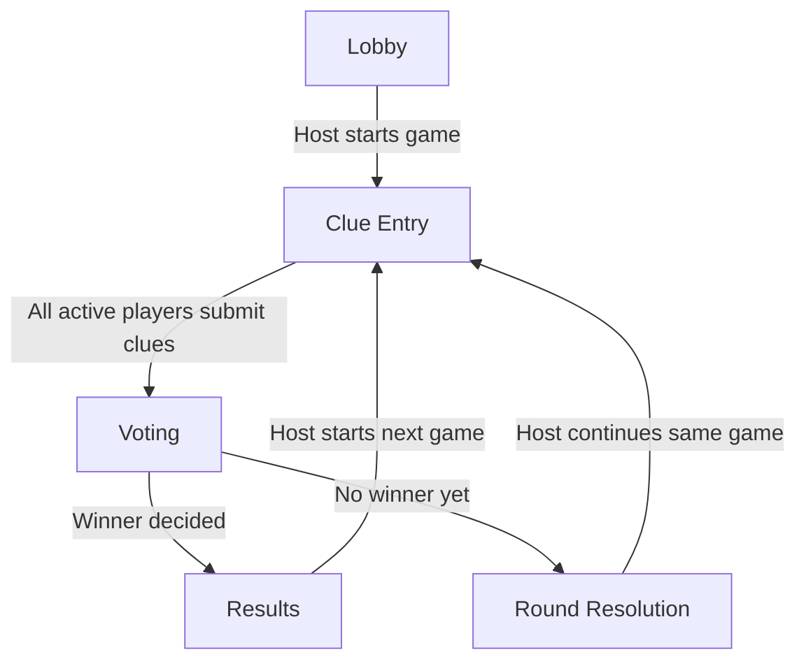

# Game Engine Logic

This document explains how the current Undercover game engine works in this repository.

It is a runtime logic document, not a target architecture document. It describes what the system currently does across the shared domain engine, server orchestration, and client-facing behavior.

## Source Of Truth

Core game logic lives in:

- `packages/shared/src/round-factory.ts`
- `packages/shared/src/clue-policy.ts`
- `packages/shared/src/vote-policy.ts`
- `packages/shared/src/outcome-policy.ts`
- `packages/shared/src/game-core.ts`
- `packages/shared/src/schemas.ts`

Server orchestration lives in:

- `apps/server/src/game/room.service.ts`
- `apps/server/src/game/room-query.service.ts`
- `apps/server/src/socket/room.gateway.ts`

## Engine Invariants

These rules are expected to stay true unless the engine design changes.

- The server is authoritative for room state, round state, and secret assignment.
- Public room snapshots never contain secret words, player session ids, or undercover history.
- A game can only start with `3` to `8` players.
- Exactly one undercover exists in each game.
- Clues are one-per-active-player, in server-defined turn order.
- Votes are one-per-active-player, with no self-votes.
- Scoreboard points are awarded only when a game ends.
- Locale and word pack changes are allowed only between games.
- Disconnect, leave, and kick must not leave the round stuck in clue or vote flow.

## Phase Flow Diagram

## Core Entities

### Room

A `Room` stores:

- room identity and code
- selected word pack
- selected locale
- joined players
- current round state
- scoreboard
- undercover history across games in the same room

Important fields:

- `wordPackId`
- `locale`
- `players`
- `round`
- `scoreboard`
- `undercoverHistory`

### Player

Each player stores:

- public id
- private session id
- nickname
- host status
- connection status
- join time
- elimination timestamp for the current game

### Round State

Each round stores:

- `gameNumber`
- `roundNumber`
- current phase
- current clue turn player
- active player ids
- clue list
- vote list
- eliminated player id
- vote resolution reason
- undercover player id
- civilian word
- undercover word
- final outcome if the game ended

## Public Vs Private State

The engine separates private game state from public room state.

Private-only fields include:

- player `sessionId`
- `undercoverPlayerId`
- `civilianWord`
- `undercoverWord`
- `undercoverHistory`

Public room projection is created in `packages/shared/src/game-core.ts` with `toPublicRoom()`.

Rules:

- players never receive other players' session ids
- the undercover id is hidden until `results`
- the secret words are never exposed in public room snapshots
- undercover assignment history is server-only

## Word Pack And Locale Logic

The room has one active locale:

- `en`
- `my`

The room also has one active word pack.

Behavior:

- room locale is selected on creation
- host can change locale only between games
- host can change word pack only between games
- if a selected pack is not available in the new locale, the server falls back to the locale default pack

Word selection for a new game:

1. load the active word pack for the current room locale
2. choose one civilian/undercover word pair randomly
3. give the civilian word to all non-undercover players
4. give the paired undercover word to the undercover player

## Game And Round Numbering

The system tracks both game and round counters.

### Game Number

`gameNumber` increases when a fresh game starts:

- from `lobby`
- or after `results`

### Round Number

`roundNumber` starts at `1` for a new game.

It increases only when the same game continues after a non-final vote result.

Examples:

- new room -> `game 0 / round 0 / lobby`
- start first game -> `game 1 / round 1`
- skip vote and continue -> `game 1 / round 2`
- end game and restart -> `game 2 / round 1`

## Role Assignment Logic

Role assignment happens when `createRound()` is called.

Rules:

- exactly one player is `undercover`
- everyone else is `civilian`
- clue turn order is randomized independently

### Undercover Selection

The current algorithm is intentionally random-first, with only a hard streak cap.

It does not try to evenly distribute undercover role by lifetime counts.

Instead:

1. the server keeps `undercoverHistory` in the room
2. on each new game, the engine checks the latest consecutive undercover streak
3. it computes a dynamic max streak from player count
4. if the latest undercover has already hit the cap, that player is excluded
5. otherwise all players remain eligible
6. selection is random among eligible players

### Dynamic Consecutive Streak Cap

Current formula:

- `maxStreak = max(2, floor((playerCount + 1) / 2))`

That means:

- `3 players` -> cap `2`
- `4 players` -> cap `2`
- `5 players` -> cap `3`
- `6 players` -> cap `3`
- `7 players` -> cap `4`
- `8 players` -> cap `4`

Behavior examples:

- with `3` players, `A -> A` is allowed but `A -> A -> A` is blocked
- with `5` players, `A -> A -> A` is allowed but `A -> A -> A -> A` is blocked

This is meant to preserve randomness while preventing extreme repetitive streaks.

### Turn Order Selection

Turn order is randomized separately from undercover selection.

The first player in the shuffled active order becomes:

- `currentTurnPlayerId` at round start

All active players are initially included in:

- `activePlayerIds`

## Phases

Current round phases:

- `lobby`
- `role-reveal`
- `clue-entry`
- `voting`
- `round-resolution`
- `results`

Current active gameplay flow uses:

- `lobby`
- `clue-entry`
- `voting`
- `round-resolution`
- `results`

`role-reveal` exists in schema but is not currently a separate enforced gameplay step.

## Phase Flow

### 1. Lobby

Room waits for host start.

Allowed:

- join room
- leave room
- kick player
- change locale
- change word pack
- start new game

### 2. Clue Entry

Each active player submits exactly one clue in turn order.

Rules:

- only the current turn player can submit a clue
- only active players may act
- after each clue, turn advances to the next active player
- after the final clue, phase changes to `voting`

### 3. Voting

Every active player votes once.

Rules:

- active players only
- no self-votes
- vote target must be active or `null` for skip
- duplicate voting is rejected
- votes remain hidden until resolution

When all active players have voted:

- the server finalizes the round

### 4. Round Resolution

This is used only when the game does not end after a vote.

The room shows:

- whether someone was eliminated
- whether vote was skipped
- whether vote tied
- vote details for that round

Then:

- host manually continues the same game into the next clue round

### 5. Results

This is used when the game ends.

The room shows:

- winner
- eliminated player
- revealed undercover
- final votes
- scoreboard

Then:

- host may start a fresh game

## Vote Resolution Logic

Vote resolution lives in `packages/shared/src/vote-policy.ts`.

The engine counts:

- votes for players
- votes for `skip`

### Resolution Rules

When all votes are in:

1. rank player vote totals
2. compare top player total vs skip total
3. detect player tie if the top two players have the same count

Outcome rules:

- if top player votes are `0`, result is `vote-skipped`
- if `skip >= topPlayerVotes`, result is `vote-skipped`
- if top player votes are tied, result is `tie`
- otherwise top-voted player is eliminated

### Tie Behavior

Ties do not eliminate anyone.

There is no hidden deterministic tie-break now.

## Elimination And Active Players

When a player is eliminated:

- they are removed from `activePlayerIds`
- `eliminatedPlayerId` is set on the round
- `eliminatedAt` is written on the matching player record

If nobody is eliminated:

- active player list stays unchanged

## Win Conditions

Win logic lives in `packages/shared/src/outcome-policy.ts`.

### Civilians Win

Civilians win if the eliminated player is the undercover.

### Undercover Wins

Undercover wins if:

- the undercover survives elimination
- and only `2` active players remain after elimination

### No Winner Yet

If neither condition is met:

- outcome stays `null`
- room moves into `round-resolution`

## Round Finalization Logic

Finalization happens in `finalizeRound(room)`.

This function:

1. resolves votes
2. updates active players
3. computes outcome
4. sets the next phase:
   - `results` if a winner exists
   - `round-resolution` otherwise
5. updates eliminated timestamps
6. awards scoreboard points if the game ended

## Continuing The Same Game

If the game did not end, host can continue with `continueRound(room)`.

This function:

- increments `roundNumber`
- keeps `gameNumber`
- clears clues
- clears votes
- clears previous round elimination metadata
- resets clue turn to the first active player
- returns phase to `clue-entry`

## Scoreboard Logic

Scoreboard points are awarded only when a game ends.

Rules:

- if civilians win, every civilian gets `+1`
- if undercover wins, only the undercover gets `+1`

No points are awarded:

- on skip-only continuation
- on tie continuation
- on non-final civilian elimination

## Player Lifecycle During Active Games

Server-side lifecycle repair is handled in `RoomService`.

### Disconnect

When a player disconnects:

- `isConnected` becomes `false`
- if they are active in the current game, they are removed from the active round
- if they were host, host is reassigned
- the room is saved and rebroadcast

### Leave

When a player leaves:

- they are removed from room players
- if they were active, current round is repaired
- if room becomes empty, room is deleted
- host is reassigned if needed

### Kick

When host kicks a player:

- player is removed from room players
- active round is repaired if needed
- host is reassigned if needed

### Round Repair

If a removed player was part of the current game:

- they are removed from `activePlayerIds`
- any votes involving them are removed
- if they were the current clue player, turn advances to the next active player

This prevents stuck clue or vote flow.

## Reconnect Logic

Reconnect uses the saved session id on the same device.

On reconnect:

- server restores the player session
- player is marked connected
- room snapshot is rebroadcast
- if a game is already running, the server re-sends the player's private role payload

This keeps private role state recoverable after refresh or socket reconnect.

## Client Role And Secret Display

The server sends a private `room:role` event only to the correct player.

The client stores:

- `role`
- secret `word`

The player can:

- show the secret
- hide the secret

Public room snapshots never contain this secret payload.

## Language Behavior

There are two separate language-related concepts:

1. room locale
   - affects word pack language and selected words
2. UI translation locale
   - affects labels such as phase names, role labels, buttons, and notes

The room locale is authoritative and rebroadcast from the server.

When host changes room locale between games:

- room snapshot updates
- word pack may be normalized to a locale-supported pack
- next started game uses the new locale's words

## Current Intentional Design Choices

### Randomness Over Forced Rotation

The engine intentionally allows short undercover repeats.

Example:

- in a 3-player room, the same player may be undercover twice in a row

But it blocks extreme streaks:

- in a 3-player room, the same player cannot be undercover 3 times in a row

This keeps the game feeling more human and less predictable than strict balancing.

### No Hidden Tie-Breakers

Ties do not silently eliminate someone.

That makes the result easier to understand and fairer for party play.

### Host-Driven Round Continuation

After non-final resolution, the host explicitly continues the game.

This keeps pacing visible and avoids abrupt automatic jumps into the next clue round.

## Current Limitations

The current engine does not yet include:

- Mr. White
- spectator mode
- timers
- automatic host migration UI prompts
- explicit role reveal phase UX
- custom packs
- player accounts

## Summary

The current game engine is:

- server-authoritative
- phase-driven
- deterministic in rules
- random in word and role assignment
- protected against extreme undercover streaks
- resilient to disconnect, leave, and kick during active play

The key runtime loop is:

1. host starts game
2. engine picks words, undercover, and turn order
3. players submit clues in order
4. players vote
5. server resolves elimination or skip/tie
6. game either ends in `results` or continues through `round-resolution`
7. host starts next game or continues current one
